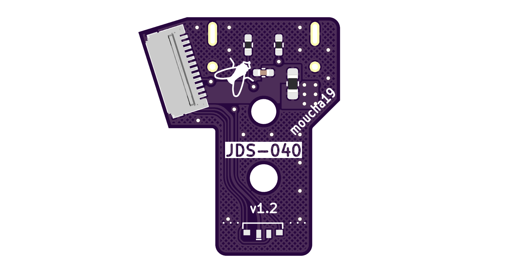
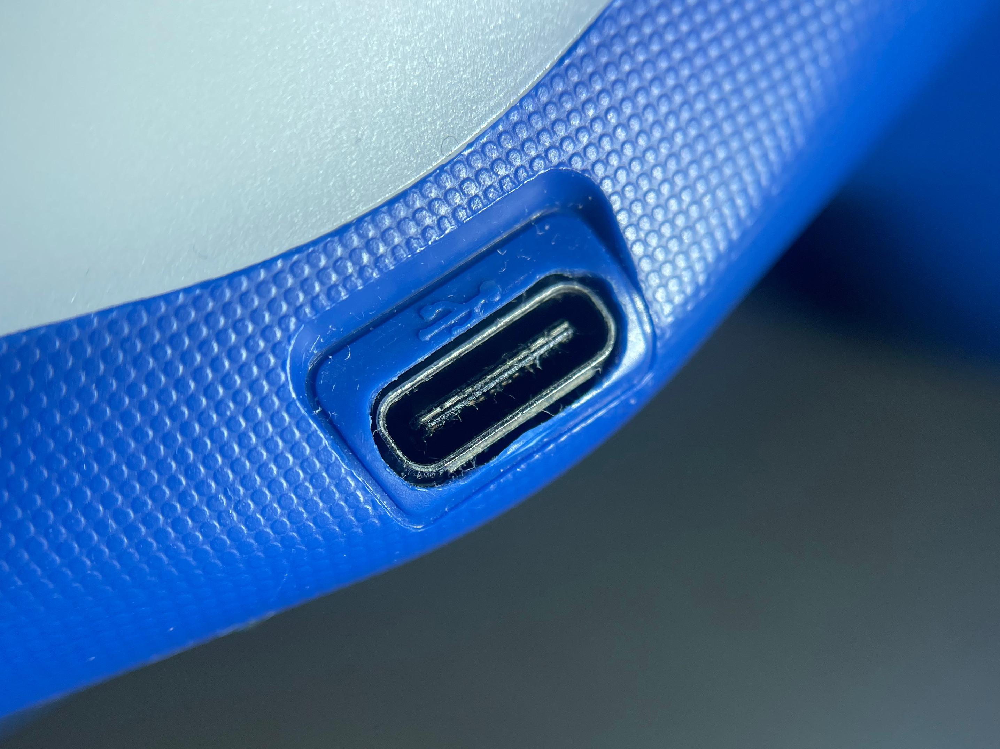
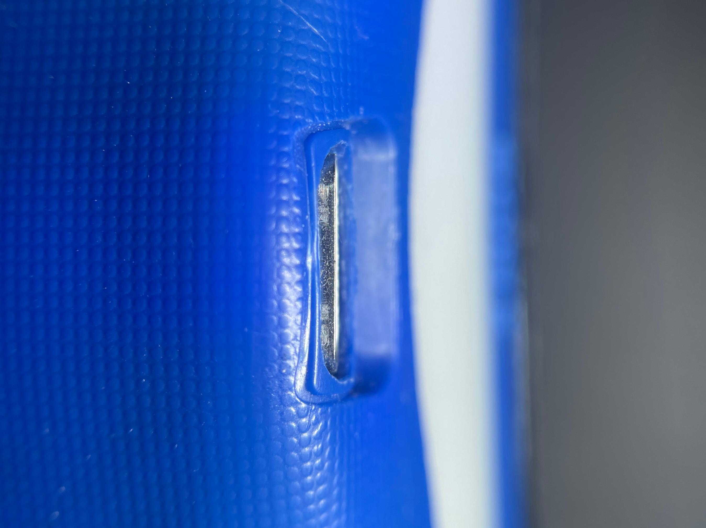
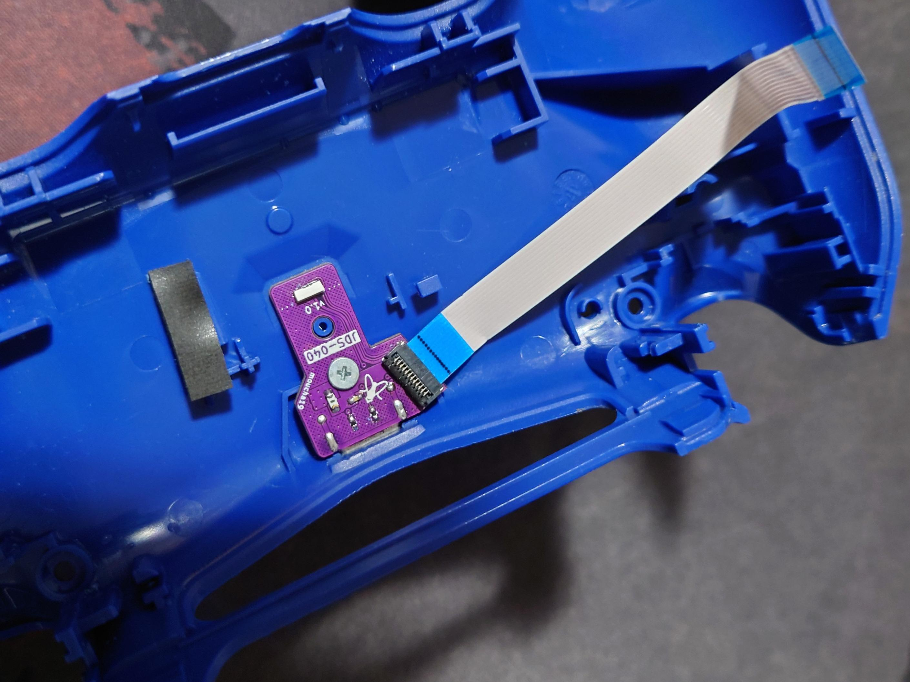
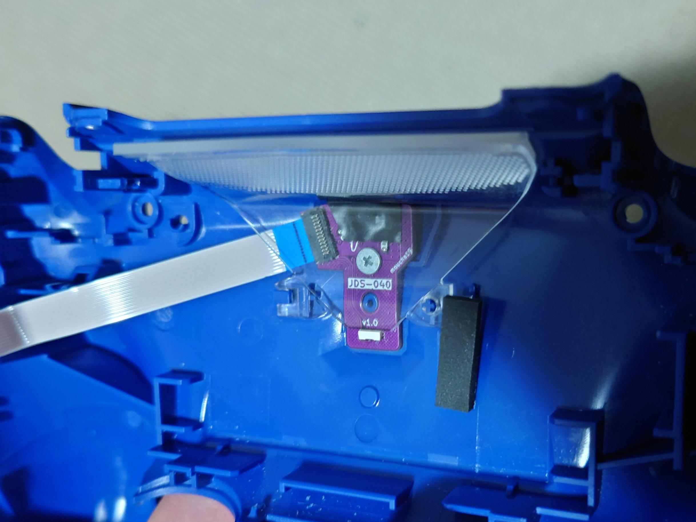

# USB-C daughterboard for DualShock 4 controller

## Features 

* Almost drop-in replacement **for JDS-040**
    + Original dimensions are maintained
    + Screw hole is in the right spot
    + However, you still need to enlarge the connector hole in the controller case
* Compatible with USB-C to USB-C cables
* Board schematic is as close as possible to the original
* All components can be purchased from [LCSC](https://www.lcsc.com/)

## Manufacturing instructions

You can find the archive with Gerber files in the releases section. 

**When ordering, you must choose a 1.2 mm PCB thickness!**

### Bill of Materials

| Designator | Footprint                                                 | LCSC    |
|------------|-----------------------------------------------------------|---------|
| C1         | 10nF  SMD 0402 Capacitor | [C15195](https://www.lcsc.com/product-detail/C15195.html)  |
| D2         | LED RGB Foshan FM-3510RGBA-SG           | [C727903](https://www.lcsc.com/product-detail/C727903.html) |
| F2         | 5V 500mA SMD 0603 Fuse       | [C210356](https://www.lcsc.com/product-detail/C210356.html) |
| FL1        | TDK MCZ1210DH Common mode filter              | [C383353](https://www.lcsc.com/product-detail/C383353.html) |
| J1         | USB-C Receptacle GT-USB-7025             | [C963213](https://www.lcsc.com/product-detail/C963213.html) |
| J2         | JUSHUO AFC42-S12FMA-1H or MOLEX 5034801200 | [C466532](https://www.lcsc.com/product-detail/C466532.html) or [C587969](https://www.lcsc.com/product-detail/C587969.html) |
| R1,R2      | 5.1k  SMD 0402 Resistor  | [C105872](https://www.lcsc.com/product-detail/C105872.html) |

## PCB Assembly

This is a very small and finicky board. I made no optimizations for the SMT assembly, because you need to solder fine pitch connectors and components on both sides of the board. It may still be a viable option if you can get assembly for both sides, but since the part count is very low, you can also manage the assembly on your own if you have a right equipment. 

Hot air gun is very handy, especially for soldering of the USB-C and FPC connectors. In my opinion, the easiest method is to tin all of the pads first and then simply position the connectors under the hot air. Rest of the components is manageable with a reasonably fine soldering iron.

# Mounting instructions

I would highly recommend you to watch instruction video from Marius Heier, on [YouTube](https://www.youtube.com/watch?v=nGKyBJVDXDQ). He created it as a guide for mounting of his own USB-C DualShock 4 mods and his advice on how to enlarge the charging port hole is excellent. Definitely start from the inside first. It might be tempting to grab a Dremel but I proceeded just like in the video, manually with a small file. 

Some additional advice that I can give after going through the process is to take it slow once you start making the charging port hole larger. You absolutely **MUST** take away some material both from top and bottom of the hole. One mistake I did was that I focused on the bottom first and then went a little overboard. I should've proceeded symmetricaly because the top also had to be filed down. You can find detailed photos below so you have some idea where roughly to stop. The USB symbol is a good reference.

The toughest challenge when designing the board was deciding where exactly to position the charging port. I did not want it to protrude too much but on the other hand, I did not want it to be buried, with a visible gap between the plastic and the edge of the connector. In the end, this is how it looks and I'm quite satisfied with the result. The bottom of the connector is visible a little bit, but the top edge is in the ideal position. Anyways, here is a detail so you easily decide to modify the board and shift the connector in either direction based on your preference. The protrusion is roughly **0.4 mm**.

Rest of the process is very easy though and the board should fit snugly. When it comes to the light output, the LED I chose performs as well as the original and I was not able to tell the difference.

